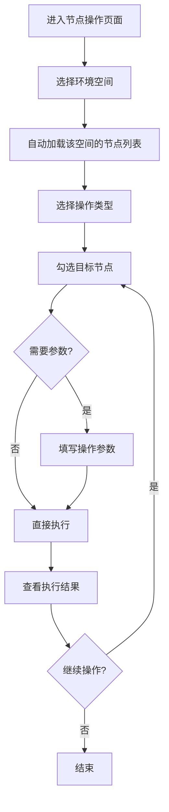

# 节点操作系统 v2.0 - 基于环境空间的节点批量操作

## 设计理念

重新设计的节点操作界面，采用**环境空间驱动**的方式：

1. **选择环境空间** - 确定操作范围
2. **选择操作类型** - 确定要做什么
3. **选择目标节点** - 从环境空间中选择具体节点
4. **填写参数并执行** - 提供必要参数，一键批量执行

## 页面布局

### 顶部：双卡片布局

```
┌─────────────────────────┐  ┌─────────────────────────┐
│  🏢 选择环境空间         │  │  ⚙️ 选择操作类型         │
│                         │  │                         │
│  [环境空间下拉选择]      │  │  [检测连通性]           │
│                         │  │  [上传文件]             │
│  空间名称: 测试环境      │  │  [替换文件]             │
│  节点数量: 10           │  │  [执行命令]             │
│  描述: ...              │  │                         │
│                         │  │  操作说明：             │
│                         │  │  检测选中节点的网络...   │
└─────────────────────────┘  └─────────────────────────┘
```

### 中间：节点选择和参数配置

```
┌────────────────────────────────────────────────────┐
│  📊 选择目标节点                      [执行操作]    │
├────────────────────────────────────────────────────┤
│  ☑  节点名称   IP地址      状态   操作系统          │
│  ☑  node1    192.168.1.1  在线   CentOS 7         │
│  ☑  node2    192.168.1.2  在线   Ubuntu 20        │
│  □  node3    192.168.1.3  离线   CentOS 8         │
├────────────────────────────────────────────────────┤
│  已选择 2 个节点 (node1, node2)                    │
├────────────────────────────────────────────────────┤
│  ══════════════ 操作参数 ══════════════            │
│                                                    │
│  选择文件: [选择文件]                              │
│  远程路径: /tmp/myfile.txt                         │
└────────────────────────────────────────────────────┘
```

### 底部：执行结果展示

```
┌────────────────────────────────────────────────────┐
│  ✅ 操作结果                           [清空结果]   │
├────────────────────────────────────────────────────┤
│  总计: 2个节点   成功: 2个   失败: 0个             │
├────────────────────────────────────────────────────┤
│  节点名称  执行状态    详细信息                     │
│  node1     成功       文件已上传到 /tmp/...        │
│  node2     成功       文件已上传到 /tmp/...        │
└────────────────────────────────────────────────────┘
```

## 四种操作类型

### 1. 🔗 检测连通性

**用途**: 检测节点是否可达，SSH连接是否正常

**无需额外参数**，选择节点后直接执行

**返回结果**:
- 连通状态（连通/不可达）
- 连接信息
- 检测时间

### 2. 📤 上传文件

**用途**: 将本地文件批量上传到多个节点

**需要参数**:
- 本地文件：选择要上传的文件
- 远程路径：目标节点的存储路径

**返回结果**:
- 上传状态
- 文件大小
- 远程路径
- 上传时间

### 3. 🔄 替换文件

**用途**: 替换节点上已存在的文件，可选备份

**需要参数**:
- 本地文件：用于替换的新文件
- 远程路径：要替换的目标文件路径
- 备份原文件：是否自动备份（默认是）

**返回结果**:
- 替换状态
- 备份文件路径（如果开启备份）
- 文件大小
- 替换时间

### 4. 💻 执行Shell命令

**用途**: 批量在多个节点上执行Shell命令

**需要参数**:
- Shell命令：要执行的命令内容（支持多行）

**返回结果**:
- 执行状态
- 命令输出
- 退出码
- 执行时间

**二次确认**: 为安全考虑，执行命令前会弹出确认对话框

## 操作流程

### 标准操作流程



### 示例1: 批量上传配置文件

1. 选择环境空间：**"生产环境"**
2. 选择操作类型：**"上传文件"**
3. 勾选节点：选择 10 台 Web 服务器
4. 填写参数：
   - 选择文件: `nginx.conf`
   - 远程路径: `/etc/nginx/nginx.conf`
5. 点击**"开始上传"**
6. 查看结果：10台全部上传成功

### 示例2: 批量清理日志

1. 选择环境空间：**"测试环境"**
2. 选择操作类型：**"执行命令"**
3. 勾选节点：选择全部节点
4. 填写参数：
   ```bash
   find /var/log -name "*.log" -mtime +7 -delete
   ```
5. 确认执行
6. 查看每个节点的执行输出

### 示例3: 检测连通性

1. 选择环境空间：**"开发环境"**
2. 选择操作类型：**"检测连通性"**
3. 勾选节点：全选
4. 点击**"开始检测"**（无需其他参数）
5. 查看连通性报告

## 核心特性

### 1. 环境空间驱动

- 所有操作都基于环境空间
- 节点列表自动从选中的环境空间加载
- 隔离不同环境的操作范围

### 2. 操作类型前置选择

- 先选择要做什么，再填写参数
- 每种操作类型有不同的参数表单
- 提供操作说明和安全提示

### 3. 灵活的节点选择

- 支持全选/取消全选
- 支持多选任意节点
- 实时显示已选节点名称

### 4. 参数动态表单

- 根据操作类型动态显示参数表单
- 连通性检测无需参数
- 文件操作需要文件和路径
- 命令执行需要命令内容

### 5. 即时结果反馈

- 操作完成立即显示结果
- 结果保留在页面底部
- 可以查看历史操作结果
- 可以清空结果重新开始

### 6. 安全机制

- 危险操作（命令执行、文件替换）有二次确认
- 文件替换默认开启备份
- 显示警告提示
- 操作日志可追溯

## 技术实现

### 前端组件结构

```vue
<template>
  <div class="node-operations-container">
    <!-- 顶部：环境空间 + 操作类型 -->
    <el-row :gutter="20">
      <el-col :span="12">环境空间选择卡片</el-col>
      <el-col :span="12">操作类型选择卡片</el-col>
    </el-row>

    <!-- 中间：节点选择 + 参数表单 -->
    <el-card class="main-card">
      <节点列表表格 />
      <选中节点信息 />
      <动态参数表单 v-if="needsParams" />
    </el-card>

    <!-- 底部：执行结果 -->
    <el-card v-if="hasResults" class="result-card">
      <结果统计 />
      <结果详情表格 />
    </el-card>
  </div>
</template>
```

### 状态管理

```javascript
// 环境空间相关
const spaces = ref([]);              // 所有环境空间
const selectedSpaceId = ref(null);   // 选中的空间ID
const selectedSpace = ref(null);     // 选中的空间对象

// 节点相关
const nodes = ref([]);               // 当前空间的节点列表
const selectedNodes = ref([]);       // 选中的节点

// 操作相关
const operationType = ref('connectivity');  // 操作类型
const operationResults = ref([]);    // 操作结果

// 表单数据
const uploadForm = ref({});
const replaceForm = ref({});
const commandForm = ref({});
```

### API调用

```javascript
// 1. 加载环境空间列表
const spaces = await environmentSpacesApi.getEnvironmentSpaces();

// 2. 根据空间ID加载节点
const nodes = await environmentSpacesApi.getEnvironmentSpaceNodes(spaceId);

// 3. 执行操作
const result = await nodeOperationsApi.checkConnectivity(nodeIds);
const result = await nodeOperationsApi.uploadFile(nodeIds, path, file);
const result = await nodeOperationsApi.replaceFile(nodeIds, path, file, backup);
const result = await nodeOperationsApi.executeCommand(nodeIds, command);
```

### 操作类型配置

```javascript
const operationTypeInfo = {
  connectivity: {
    title: "连通性检测",
    type: "info",
    description: "检测选中节点的网络连通性和SSH连接状态",
    icon: Connection,
    buttonText: "开始检测",
  },
  upload: {
    title: "上传文件",
    type: "success",
    description: "将本地文件上传到选中节点的指定路径",
    icon: Upload,
    buttonText: "开始上传",
  },
  replace: {
    title: "替换文件",
    type: "warning",
    description: "替换选中节点上的文件，可选择是否备份原文件",
    icon: RefreshRight,
    buttonText: "开始替换",
  },
  command: {
    title: "执行Shell命令",
    type: "danger",
    description: "在选中节点上批量执行Shell命令",
    icon: Terminal,
    buttonText: "执行命令",
  },
};
```

## UI/UX优化

### 1. 视觉层次

- 使用卡片布局分隔不同功能区域
- 重要操作按钮使用主题色
- 危险操作使用警告色

### 2. 交互反馈

- 操作按钮loading状态
- 操作完成后消息提示
- 结果实时展示

### 3. 表单验证

- 必填项校验
- 文件类型校验
- 路径格式校验

### 4. 响应式设计

- 自适应不同屏幕尺寸
- 表格横向滚动
- 卡片堆叠布局

## 与旧版对比

| 特性 | v1.0 (步骤式) | v2.0 (环境空间驱动) |
|-----|--------------|-------------------|
| 节点来源 | 全局所有节点 | 环境空间内节点 |
| 操作流程 | 4步向导式 | 单页面配置式 |
| 连通性检测 | 必须步骤 | 可选操作 |
| 操作类型选择 | 第3步 | 第2步（前置） |
| 参数填写 | 独立步骤 | 动态表单 |
| 结果查看 | 独立步骤 | 页面底部 |
| 适用场景 | 新手友好 | 效率优先 |

## 优势

1. **更高效** - 减少步骤，单页面完成所有操作
2. **更灵活** - 可以随时切换操作类型
3. **更直观** - 所有信息在一个页面
4. **更专业** - 环境空间驱动符合运维习惯
5. **可重复** - 结果保留，可以继续操作

## 使用场景

### 运维场景

1. **配置分发**: 将配置文件批量分发到生产环境
2. **应用部署**: 上传应用包到多台服务器
3. **日志清理**: 定期清理过期日志文件
4. **状态检查**: 检查服务运行状态
5. **紧急修复**: 快速替换有问题的文件

### 测试场景

1. **环境准备**: 批量上传测试数据
2. **状态重置**: 批量执行重置命令
3. **配置更新**: 快速更新测试配置

## 文件清单

### 后端（无变化）
- ✅ `backend/app/views/node_operations.py` - API接口
- ✅ `backend/application.py` - 蓝图注册

### 前端（已更新）
- ✅ `frontend/src/views/NodeOperations.vue` - 页面组件（重构）
- ✅ `frontend/src/api/nodeOperations.js` - API调用
- ✅ `frontend/src/router/index.js` - 路由配置

## 访问方式

```
URL: /node-operations
菜单: 节点操作
图标: Operation
权限: 需要登录
```

---

**版本**: v2.0
**更新时间**: 2026-03-27
**设计理念**: 环境空间驱动 + 操作类型前置 + 单页面高效操作
**状态**: ✅ 完成
